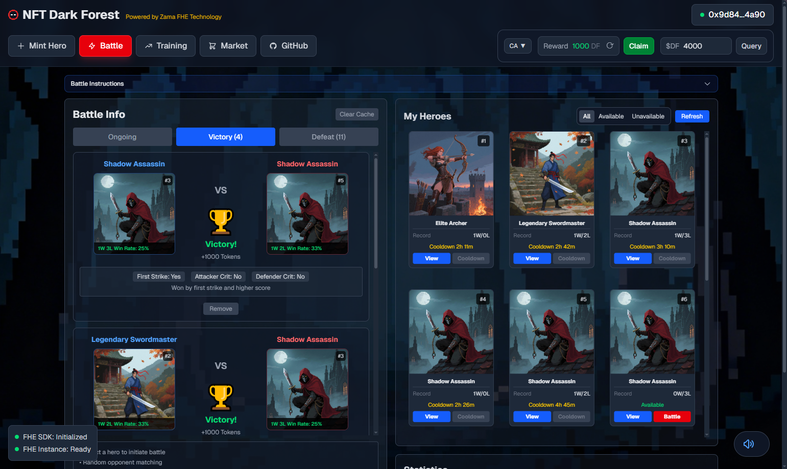

# NFT Dark Forest

##  [Live Demo: nft-dark-forest.vercel.app](https://nft-dark-forest.vercel.app)

This is a fully-featured on-chain NFT battle game powered by Zama Fully Homomorphic Encryption technology. All battle calculations are performed on-chain through FHE encryption, attributes remain completely private, and battle results are asynchronously decrypted via Zama Gateway. NFT value is determined by a single public attribute: win-loss record.



## Contract Features Summary

### Key Design Features

- **Fully On-Chain Encrypted Combat**: Attributes, battle processes, and results are all FHE-encrypted, verifiable on-chain without revealing privacy
- **Asynchronous Decryption Model**: Decryption through Zama Gateway ensures security and verifiability
- **Asymmetric Battle Mechanism**: Only the initiator is affected by rewards and cooldowns, defenders remain unaffected
- **Zero-Knowledge Attribute Training**: Attribute upgrades are encrypted, external observers cannot infer specific values
- **Modular Design**: Battle, token, and marketplace are separated for independent upgrades and extensions

## Notes

1. **Testnet Optimization**: Cooldown time has been shortened and matching with own heroes is supported for better experience
2. **Network Switching**: FHE instance is automatically reinitialized after network switching
3. **Event Caching**: First load queries the most recent 50000 blocks, subsequent updates are incremental
4. **Gas Costs**: FHE operations consume high gas, ensure sufficient wallet balance
5. **Gateway Latency**: Decryption callbacks may take several seconds to minutes, depending on Gateway load

### 1. DarkForestNFT.sol - Core Game Logic Contract

**Responsibility**: NFT Hero Management + FHE Encrypted Battle System + Attribute Training

#### Main Functional Modules

**NFT Minting and Attributes**

- `mint()`: Mint Hero NFT
  - Randomly assigns one of 5 classes (Brave Warrior, Legendary Swordmaster, Shadow Assassin, Elite Archer, Mystic Mage)
  - Generates FHE-encrypted 5-dimensional attributes (Attack, Defense, Health, Speed, Luck), range 0-100
  - Attributes are fully end-to-end encrypted, only the holder can decrypt and view
  - Each NFT has a unique tokenURI pointing to different metadata based on class ID

**Battle System**

- `initiateBattle(attackerTokenId)`: Initiate Battle
  - Randomly matches an opponent NFT
  - Performs FHE-encrypted battle calculations on-chain:
    - Damage Calculation: Damage = Attack - Defense/2 (minimum 1)
    - Critical Hit Determination: Triggers when Luck > 50, Damage x1.5
    - Battle Score: Score = Damage x Health
    - Victory Determination: First striker wins when Score >= Opponent, second striker must have Score > Opponent
  - Generates encrypted battle results and detailed explanation (first strike determination, critical hit info, victory reason)

- `revealBattle(requestId)`: Reveal Battle Result
  - Submits encrypted result to Zama Gateway for decryption request
  - Gateway asynchronously calls `battleCallback` to return plaintext result
  - Only affects initiator (attacker):
    - Victory: Record win, enter 5-hour cooldown, accumulate 1000 token reward
    - Defeat: Record loss, no cooldown, no reward
  - Defender is unaffected (no record, no cooldown)

- `retryReveal(requestId)`: Retry Reveal (used when Gateway callback fails)

**Attribute Training**

- `startUpgrade(tokenId)`: Start Training
  - Randomly selects one of the 5 attributes for training
  - Sets 1-minute training duration
  - NFT cannot participate in battles during training

- `finishUpgrade(tokenId)`: Complete Training
  - 50% success rate, Attribute +1 (can exceed 100)
  - Only requires gas, no token consumption
  - Attribute changes use FHE encrypted operations, maintaining privacy

**Reward System**

- `getPendingReward(address)`: Query Pending Rewards
- `claimRewards()`: Claim Accumulated Battle Rewards
  - Calls DarkForestToken contract to mint tokens to user

**Query Interfaces**

- `getBattleRecord(tokenId)`: Query battle record (wins, losses, cooldown time)
- `getBattleStats(tokenId)`: Query detailed battle statistics (including win rate, precision to 1/10000)
- `getUpgradeState(tokenId)`: Query training status
- `getEncryptedAttributes(tokenId)`: Get encrypted attribute handles (for frontend decryption)

### 2. DarkForestToken.sol - Confidential Token Contract

**Responsibility**: In-game reward token, based on OpenZeppelin ERC7984 + FHEVM

#### Main Functions

**Token Characteristics**

- Name: DarkForest (DF)
- Type: Confidential Fungible Token
- Decimals: 0 (game token requires no decimals)
- Max Supply: 10,000,000,000

**Minting and Distribution**

- `rewardWinner(winner, amount)`: Reward Distribution (only callable by NFT contract)
  - Called by NFT contract when user claims battle rewards
  - Directly mints tokens to user address
  - Updates public totalSupply

- `mint(to, amount)`: Test Minting (only callable by owner)

**Privacy Features**

- `confidentialBalanceOf(user)`: Encrypted Balance Query
  - Balances are fully encrypted in storage
  - Only the holder can decrypt and view through FHE
  - Transfer amounts are also encrypted

- `confidentialTransfer` / `confidentialTransferFrom`: Confidential Transfer
  - Transfer amounts are encrypted, on-chain observers cannot determine specific amounts
  - Supports operator mode (authorized third-party operations)

**Supply Information**

- `getSupplyInfo()`: Query Supply Statistics
  - Max supply, current supply, remaining supply, minting percentage
  - This information is publicly visible

### 3. DarkForestMarket.sol - NFT Marketplace Contract

**Responsibility**: Hero NFT Trading Marketplace (ETH Settlement)

#### Main Functions

**Listing Management**

- `list(tokenId, price)`: List NFT
  - Seller sets price (in wei)
  - Requires prior approval of marketplace contract (approve or setApprovalForAll)
  - Seller retains NFT ownership until sold

- `cancel(tokenId)`: Cancel Listing
  - Only seller can cancel

**Purchase Transactions**

- `buy(tokenId)`: Purchase NFT
  - Pay ETH to purchase
  - Automatically deducts platform fee (configurable, max 10%)
  - Remaining amount transferred to seller
  - NFT automatically transferred to buyer

**Platform Management**

- `setFee(recipient, feeBps)`: Set Fee (only owner)
  - feeBps: basis points (100 = 1%)
  - Default cap 1000 (10%)

**Query Interfaces**

- `getListing(tokenId)`: Query Listing Information
  - Seller address, price, on-sale status

## Core Features

### NFT System

- **Hero Minting**: Randomly generates one of 5 classes (Warrior, Swordmaster, Assassin, Archer, Mage)
- **Encrypted Attributes**: 5-dimensional attributes (Attack, Defense, Health, Speed, Luck) fully FHE-encrypted, range 0-100
- **Attribute Training**: Randomly selects one attribute for training, completes in 1 minute, 50% chance +1 (can exceed 100)
- **IPFS Storage**: NFT metadata and images stored on IPFS

### Battle System

- **Encrypted Battle Calculation**: On-chain FHE-encrypted battle result calculation
  - Damage Formula: `Damage = Attack - Defense/2` (minimum 1)
  - Critical Hit System: Triggers when Luck > 50, Damage x1.5
  - Battle Score: `Score = Damage x Health`
  - Victory Determination: First striker wins when Score >= Opponent, second striker must have Score > Opponent
- **Asynchronous Decryption**: Battle results decrypted through Zama Gateway
- **Battle Statistics**: Records each NFT's wins, losses, and win rate
- **Cooldown Mechanism**: Enters 5-hour cooldown after battle victory
- **Asymmetric Mechanism**: Only initiator is affected by rewards and cooldowns, defender is unaffected

### Token System

- **Confidential Token**: Based on OpenZeppelin ERC7984 + FHEVM
- **Privacy Protection**: Balances and transfer amounts fully encrypted
- **Battle Rewards**: 1000 DF tokens earned for battle victory
- **Accumulated Claiming**: Rewards accumulate in contract, users claim manually

### Marketplace System

- **NFT Trading**: Supports ETH-based buying and selling of hero NFTs
- **Secure Trading**: Based on OpenZeppelin ReentrancyGuard
- **Platform Fee**: Configurable fee rate (max 10%)

### Encryption Flow

1. **Attribute Generation**: Contract uses `FHE.randEuint8()` to generate encrypted random numbers
2. **Attribute Viewing**:
   - Contract authorizes holder to access encrypted attributes
   - Frontend obtains encrypted handles
   - User signs decryption request
   - Gateway decrypts and returns plaintext
3. **Battle Calculation**:
   - On-chain FHE-encrypted battle result calculation
   - Calls `FHE.requestDecryption()` to request decryption
   - Gateway verifies and calls back `battleCallback`
   - Contract processes plaintext result and updates state

## Key Design

### Asymmetric Battle Mechanism

- **Initiator (Attacker)**:
  - Victory: Record win, enter 5-hour cooldown, earn 1000 DF reward
  - Defeat: Record loss, no cooldown, no reward
- **Defender**:
  - No battle record
  - No cooldown
  - No reward gain/loss

### Privacy Protection

- NFT attributes fully encrypted, only holder can decrypt and view
- Battle calculation process encrypted, external observers cannot determine specific values
- Token balances and transfer amounts encrypted
- Training attribute changes encrypted

### Security Mechanisms

- **Signature Verification**: Gateway decryption callbacks require KMS signature verification
- **Replay Protection**: Decryption request ID mapping prevents replay attacks
- **Reentrancy Protection**: Marketplace contract uses ReentrancyGuard
- **Access Control**: Only authorized addresses can access encrypted data

## Tech Stack

### Frontend

- **Next.js 15** (App Router)
- **React 19**
- **TypeScript 5**
- **Tailwind CSS 4**
- **Ethers.js 6**
- **Vitest** - Testing Framework

### Blockchain

- **Zama FHEVM 0.8** - Fully Homomorphic Encryption Virtual Machine
- **OpenZeppelin Contracts** - Standard Contract Library
- **OpenZeppelin Confidential Contracts** - Confidential Token (ERC7984)
- **Hardhat** - Smart Contract Development Framework

## Quick Start

### Install Dependencies

```bash
npm install
```


### Development Commands

```bash
# Development
npm run dev

# Build
npm run build

# Start Production Server
npm start

# Code Linting
npm run lint

# Run Tests
npm test
```

Visit http://localhost:3000


## License

MIT
